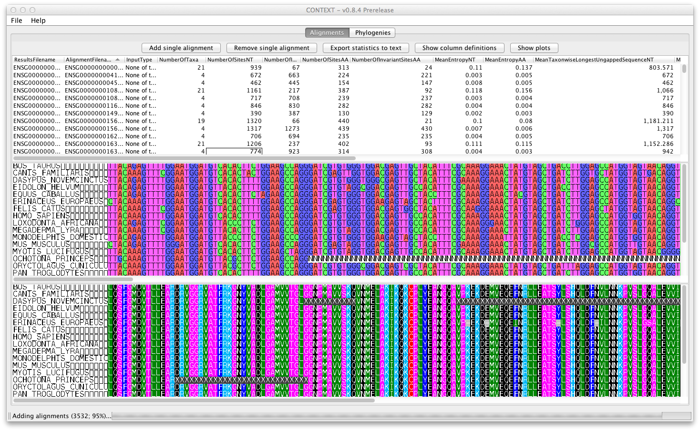
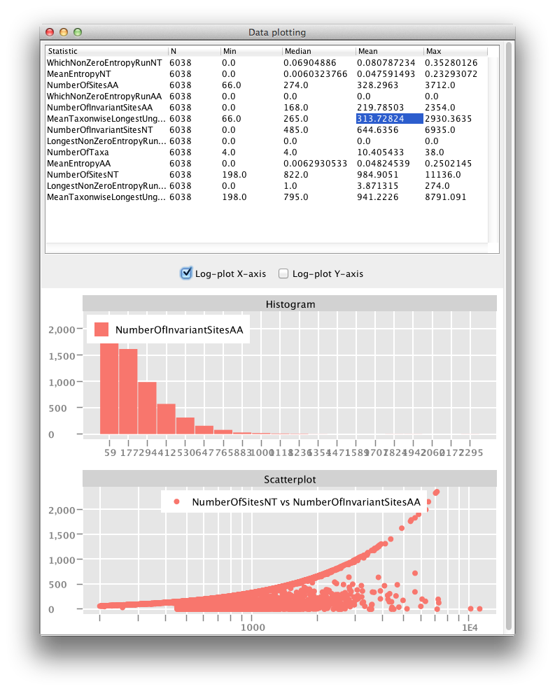
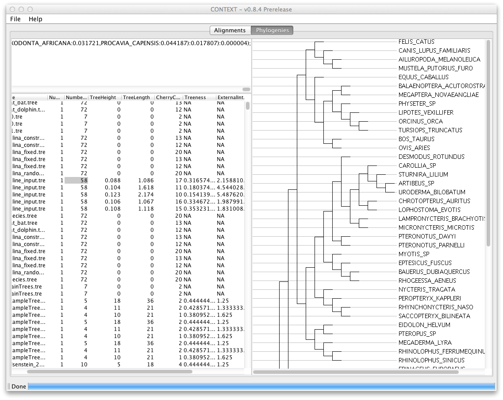
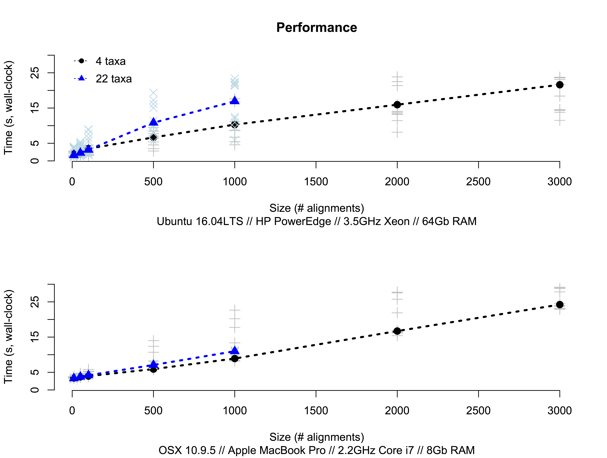

# CONTEXT / Phylogenomic Dataset Browser

_COmparative Nucleotide (and amino-acid) and Trees EXplorer Tool_

---

## What does it do?

A QC (quality control) tool for phylogenomics data, basically - it simultaneously displays large numbers (~thousands) of multiple sequence alignments and/or phylogenies, along with summary statistics. 

## Why does it do that?

Phylogenomic analyses rely on good quality input data. Visualising and _quantitatively_ sorting/filtering input data is essential. There isn't a simple standalone tool for this at the moment.

## What _doesn't_ it do?

You can't manually edit, align, or infer phylogenies with CONTEXT. There's plenty of other tools to do this. See RAxML, Muscle, Bali-Phy, Se-Al or GUIs like HYPHY or Geneious, for a start.

## How do I get it?

This repository. See [the trunk/builds-snapshots](https://github.com/lonelyjoeparker/qmul-genome-convergence-pipeline/tree/master/trunk/builds-snapshots) for the most recent builds - [current version here](https://github.com/lonelyjoeparker/qmul-genome-convergence-pipeline/releases/tag/v0.8.4prereleasee) (v0.8.4 prerelease).

    Hint: you'll need to right-click on the compressed archives and choose 'Save link as...' in most browsers...

## How do I use it?

Double-click the jarfile; or in a command-line run the jarfile with `java -jar CONTEXT-PhylogenomicDatasetBrowser-v0.8.4prerelease.jar`. Once it's up and running, select "File > Open Alignments..." or "File > Open Phylogenies" to get started.

    We also recommend a minimum free system RAM of 2Gb, allocated using the '-Xmx' option in Java, e.g.: 
    `java -Xmx2g -Xms2g -jar CONTEXT-PhylogenomicDatasetBrowser-v0.8.4prerelease.jar`

#### Example input data

Example phylogenies and alignments are [here](https://github.com/lonelyjoeparker/qmul-genome-convergence-pipeline/tree/master/trunk/examples/CONTEXT-phylogenomic-dataset-browser-examples).

    Hint: you'll need to right-click on the compressed archives and choose 'Save link as...' in most browsers...

## How do I get help?

At the moment we're still writing the manual and help pages. General information can be found in the [README](README.md) file.

To report bugs or request features please use [this issue tracker](https://github.com/lonelyjoeparker/qmul-genome-convergence-pipeline/issues) - that way we can keep a better grip on what needs doing, and others may be able to benefit from your solutions. Please include as much detail as you can, including:
* Which OS you're using
* Which version of Java you're using (try typing `java -version` on the command line)
* What input files you were trying to load
* A copy of any error message
* A screenshot if applicable

Thanks!

## Version and Roadmap

Currently at prereleasee version 0.8.4, major version 0.8. See [CONTEXT_versions.md](CONTEXT_versions.md) for more change log and version informations.

This is intended to be the final version of CONTEXT before the full, public (publication) release, v0.9.0.

We'll start work on changes (based on user feedback) for 0.9.1+ after six months, aiming for a 1.0 release a year from now.

## Credits

CONTEXT is written in Java by Joe Parker with input from Steve Rossiter and other members of his lab. 

CONTEXT was largely developed from the Genome Convergence API supported by the BBSRC (UK) and European Research Council (2011-2015), with additional work by Joe at Kitson Consulting Ltd (2015). Continuing development / mainenance is by Joe at Royal Botanic Gardens, Kew.

## Project contact

* If you have any help queries please try the help pages described above first. 
* To log a bug or usability issue, please use the issues link above. 
* For other enquiries, including funding, packaging, and commercial licensing, please use the project email: joe+CONTEXT@kitson-consulting.co.uk

## Depdendencies and packaged libraries

CONTEXT requires Java 1.6+. 
The CONTEXT codebase references the following open-source libraries:                 
* [Colt](https://dst.lbl.gov/ACSSoftware/colt/) - Open Source Libraries for High Performance Scientific and Technical Computing (colt.jar)
* [JAMA](http://math.nist.gov/javanumerics/jama/) - Java Matrix Algebra (1.0.3, 2012.11.09; Jama-1.0.3.jar)
* [JSC](http://www.jsc.nildram.co.uk/) - Java Statistical Classes v1.0 (jsc-1.jar)
* [XStream](http://x-stream.github.io/) - Java XML bindings (xstream-1.4.4.jar and dependencies)
* [JFreeChart](http://www.jfree.org/jfreechart/) - Chart plotting library (jfreechart-1.0.14.jar)
* [XChart](https://github.com/timmolter/XChart) - Chart Plotting Library v3.3.1 (XChart-3.3.1.jar)
* [JEBL](http://sourceforge.net/projects/jebl/) - Java Evolutionary Biology Library v0.4 (jebl-0.4.jar)

The executable jarfiles (see trunk/bin directory) come with these build-path dependencies already packaged. They should run as standalone Java apps with no additional dependencies.

## Benchmarking

We are undertaking benchmarking on a variety of machines to improve performance, especially loading speed. These are implemented so far in [./benchmarks](./benchmarks). If you'd like to help, the [benchmarking build](./trunk/builds-snapshots/CONTEXT-v0.8.4prerelease-benchmarking.jar) of CONTEXT is intended to initialise, load a sample dataset (directory of alignments) specified through the command line, and then exit. The alignments used are available on request (partly from [doi:10.1038/nature12511](http://dx.doi.org/10.1038/nature12511)).

